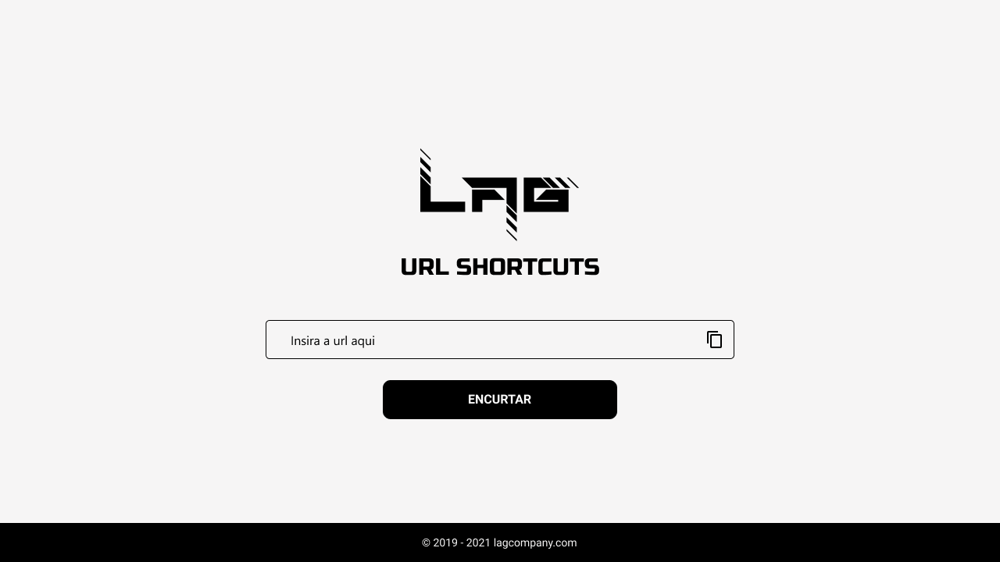

# Short-URLs 🔗

## Descrição

O projeto [Short-URLs](https://lag-tech.github.io/Short-URLs/) é uma aplicação web que permite aos usuários encurtarem URLs longas e compartilhá-las de forma mais conveniente. Com apenas alguns cliques, você pode transformar URLs complexas em links curtos e fáceis de lembrar. Além disso, o projeto também oferece estatísticas básicas sobre o número de cliques em cada URL encurtada, fornecendo insights úteis sobre o desempenho das suas URLs compartilhadas.

## Tecnologias

O Short-URLs foi desenvolvido utilizando as seguintes tecnologias:

- **HTML** - a linguagem padrão para a criação de páginas da web.
- **CSS** - uma linguagem de estilo para aprimorar o design das páginas da web.
- **JavaScript** - uma linguagem de programação que adiciona interatividade às páginas da web.

## Screenshots

Aqui estão algumas capturas de tela do projeto:

## Equipe

O Short-URLs foi desenvolvido pela seguinte equipe:

- [Adriellison Ferreira](https://github.com/adriellison/) - Dev. Back-End & Designer de UI/UX
- [Saulo Lohan](https://github.com/Saulohan/) - Dev. Full-Stack

## Links

- [Repositório do GitHub](https://github.com/adriellison/Short-URLs)
- [URL do Projeto](https://adriellison.github.io/Short-URLs/)

## Recomendações Adicionais

Se você quiser expandir ainda mais o projeto Short-URLs, aqui estão algumas recomendações:

1. **Autenticação de Usuário**: Implemente um sistema de autenticação para que os usuários possam criar suas próprias contas e gerenciar suas URLs encurtadas.
2. **Personalização**: Permita que os usuários personalizem os links curtos para torná-los mais relevantes para suas necessidades.
3. **Analytics Avançado**: Aprimore as estatísticas fornecidas, oferecendo gráficos e métricas mais detalhadas sobre o desempenho das URLs encurtadas.
4. **Integração com Redes Sociais**: Adicione a capacidade de compartilhar URLs encurtadas diretamente em plataformas populares de redes sociais.
5. **API**: Crie uma API para permitir que outros desenvolvedores integrem o serviço de encurtamento de URLs em seus próprios aplicativos e serviços.

Divirta-se explorando e melhorando o projeto Short-URLs!
